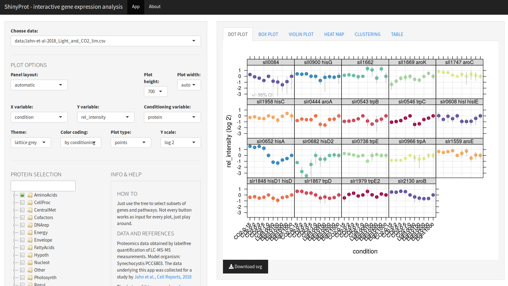

# ShinyProt

R Shiny based web app for browsing proteomics data.
**Available on [Shinyapps.io](https://m-jahn.shinyapps.io/ShinyProt/)!**

### Getting started

Simply run the app at https://m-jahn.shinyapps.io/ShinyProt/!

If you want to *run ShinyProt locally*, you need to have R (optionally also Rstudio) and some of its libraries installed, mainly:

- `shiny`
- `shinythemes`
- `shinyTree`
- `lattice`
- `latticeExtra`
- `tidyr`
- `plyr`
- `dendextend`

Open `server.R` or `ui.R` in RStudio and push the `Run App` button in Rstudio, done!
You can also run the app from R console, just call `runApp("path-to-ShinyProt)`.

### R Shiny based browser for gene expression data

ShinyProt is a small app for exploration of gene expression, proteomics, or other gene-centered biological data.
Features:

- Displays dot plots of gene expression data
- Heatmaps, box and whisker plots, and clustering of proteins/genes by expression
- Dendrogram of gene expression similarity
- Sunburst treemaps (coming soon!)
- The original data table can be filtered by pathways or single genes
- Different variables can be plotted on X and Y axis, or used as conditioning variable (panel-view)
- All charts are interactive R Shiny modules and can be adjusted by many parameters

### Structure

ShinyProt consists of a set of R scripts that determine the functionality.

- `server.R` contains the main body of functions. The server obtains input parameters from the GUI and adjusts the graphical output accordingly (changes charts on the fly)
- `ui.R` The GUI contains the interactive modules such as sliders and check boxes.
- `dotplot.R`, `heatmap.R`, and others are plotting functions for each tab
- `custom_themes.R` contains a set of customized lattice themes
- `custom_panel_functions.R` contains a set of custom lattice panel functions
- `helpbox.R` Contains info boxes for help, contact, and background information

### Input data

- ShinyProt uses protein quantifications obtained from LC-MS-MS experiments
- Can be easily customized for use with other gene-expression type data
- Can be deployed on a shiny server for web-access

### Protein quantification

#### How protein quantifications were obtained

- Protein quantity was aggregated from MS-based label-free peptide measurements using the sum
of all peptide abundances. This relative number was divided by the sum of all protein abundances
resulting in protein mass fraction (not mol fraction), the main metric used in 
**[Jahn et al., Cell Reports, 2018](https://www.sciencedirect.com/science/article/pii/S2211124718314852?via%3Dihub)**. However this metric can be used, together with some 'helper' parameters to convert
protein mass in to mol fraction, molecules per cell, molecules per volume, and others.

#### How other protein metrics were calculated

- **Protein mass in g/gDCW**. This is simply the protein mass fraction (g/g) multiplied by
  protein content per DCW (on average 65% for cyanobacteria, *Touloupakis et al., Biotechnology for Biofuels, 2015*, 
  or 68% for *Cupriavidus neactor*, *Park et al., BMC Sys Biol, 2011.*

- **Mol fraction of proteins** (number of protein as fraction of total protein number).
  Divide mass fraction (g/g) by molar mass (g/mol), and divide every protein mol by sum of mol.

- **Protein mass in g/L cell volume**. Here is an extra parameter required, the cell volume in 
  L/gDCW (NB: not culture volume!).
  
- **Protein concentration (mol protein / cell)**. That is protein mass fraction in g/gDCW multiplied
  with gDCW/cell, divided by molar mass in g/mol
  
- **Protein concentration (mol protein / L cell volume)**. Multiply mol protein per cell with N
  cells per L
  
- **Protein concentration (copies protein / cell)**. Simply multiply mol/cell by Avogadro constant
  (1/mol)
  
- **Conversion factors needed for transformation:**
  
  1 gDCW/L culture = OD 4 (in-house measurement, *Anfelt et al., Microb Cell Fact, 2015*)
  
  OD 4 = 25 * 10^10 cells/L (µ = 0.08; *Du et al., Algal Research, 2016*), so that
  
  N (1 gDCW) = 25 * 10^10 cells
  
  V (1 cell) = 9 * 10^-15 L (µ = 0.08; *Du et al., Algal Research, 2016*)
  
  N (1 L cell volume) = 1/(9 * 10^-15) = 1.11111 * 10^14 cells
  
  V (1 gDCW cells) = 25*10^10 cells * 9*10^-15 L/cell = 0.00225 L/gDCW = 2.25*10^-3 L/gDCW
